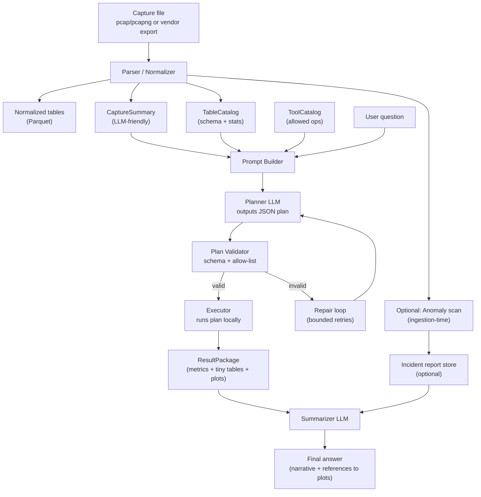
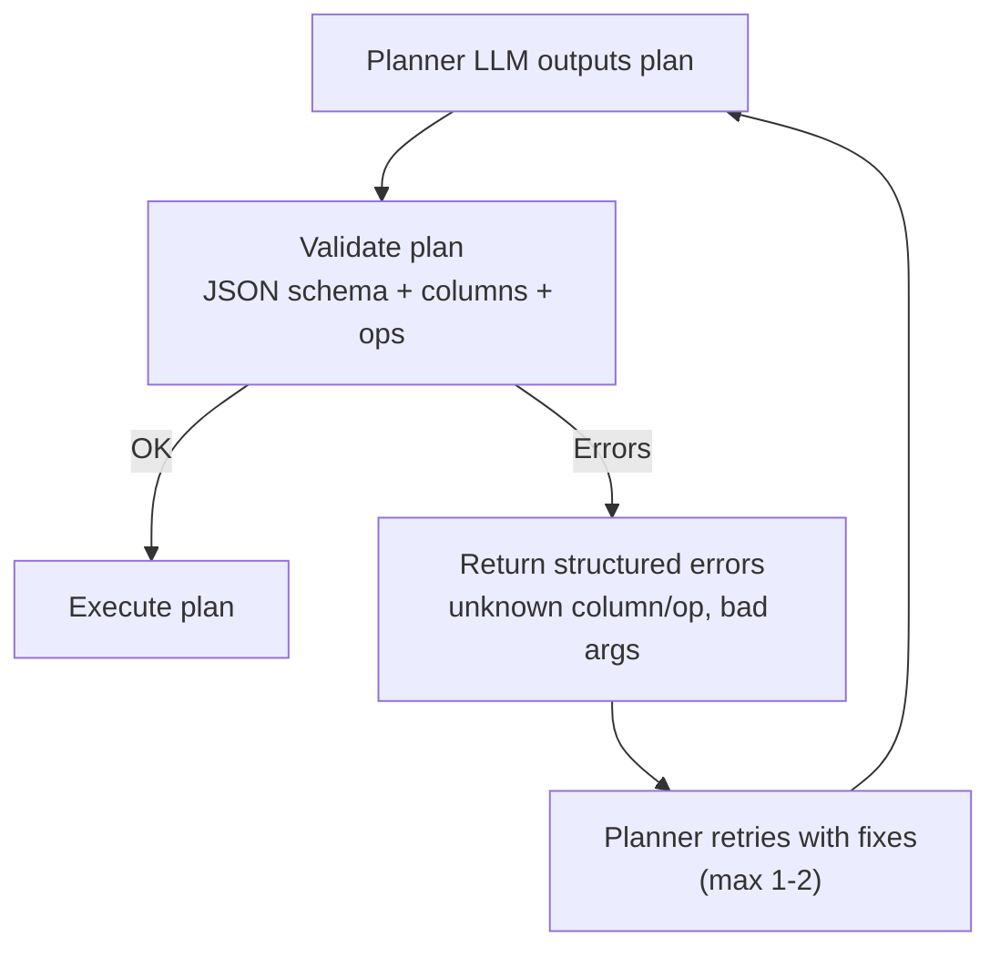
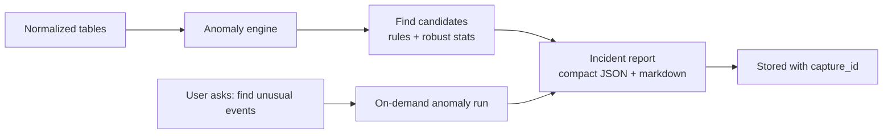

# Design Description: LLM-Guided Statistical Analyst + Optional Anomaly Detection (BLE / Wi-Fi)

## 1) Purpose
Build an assistant that:
- takes a **natural-language question** about a wireless capture (Bluetooth LE or Wi-Fi),
- turns it into a **runnable analysis** over **capture-derived tables (pandas DataFrames)**,
- returns **tables/plots + a clear written summary**, and optionally
- runs **automatic anomaly detection** and emits a **compact incident report**.

## 2) Core constraint
Raw captures (pcap/pcapng) are too large and too noisy to send to an LLM. So the system must:
- transform captures into **normalized tables**, and
- provide the LLM only **compact, LLM-friendly metadata** (table schemas + summary stats + tool catalog),
- while executing analysis **locally**.

---

## 3) System architecture (high level)

### A. Ingestion / Normalization
1. Capture input: BLE / Wi-Fi (pcapng or vendor export).
2. Parser extracts protocol fields → writes **normalized columnar tables** (prefer Parquet) and loads to pandas when needed.
3. Generate:
   - **CaptureSummary** (LLM-friendly text/JSON)
   - **TableCatalog** (tables, columns, dtypes, row counts, time coverage, key columns)
   - Optional **AnomalyContext** (precomputed anomalies / unusual events list)

### B. Analysis assistant (two-stage LLM)
4. **Planner LLM**: receives `{CaptureSummary + TableCatalog + ToolCatalog + UserQuestion}` and outputs a **structured plan**.
5. **Executor**: validates plan (schema + allow-list), executes using pandas/your analysis functions, produces:
   - Result tables (small), stats (numbers), plots (paths), warnings/errors
6. **Summarizer LLM**: receives `{UserQuestion + ResultPackage}` and writes:
   - final answer narrative
   - optionally a compact incident report section (if anomalies requested or found)

---

## 4) Flowcharts

### 4.1 End-to-end pipeline


### 4.2 Plan validation & repair loop (bounded)


### 4.3 Anomaly detection paths


---

## 5) Data model

### 5.1 Normalized tables (examples)
Keep these minimal and consistent across captures; store as Parquet for speed and reproducibility.

**BLE (example tables)**
- `ble_adv_events`  
  `ts, advertiser_addr, addr_type, adv_type, channel, rssi, pdu_len, company_id, service_uuids, mfg_data_len, scan_rsp_present, crc_ok, ...`
- (Optional) `ble_conn_events`, `ble_l2cap`, `ble_att` if you need deeper questions later.

**Wi-Fi (example tables)**
- `wifi_mgmt_frames`  
  `ts, transmitter_mac, receiver_mac, bssid, frame_subtype, ssid, channel, rssi, capabilities, supported_rates, rsn_present, ...`
- (Optional) `wifi_data_frames`, `wifi_eapol`, etc.

**Capture metadata**
- `metadata.json`  
  capture start/end, environment notes, known devices, expected SSIDs, test scenario labels, etc.

### 5.2 CaptureSummary (LLM-friendly)
A compact object (rendered as text or JSON) like:
- capture duration, packet counts by protocol/table
- time resolution / clock notes
- top talkers / top advertisers / top SSIDs (top N only)
- RSSI ranges and percentiles
- channel distributions
- “known device list” if provided

### 5.3 ToolCatalog (what the LLM is allowed to use)
A **small, fixed set** of operations the planner can invoke. Example categories:
- selection/filtering: `filter_rows`, `select_columns`, `limit`
- time series: `resample_time`, `interarrival_stats`, `rolling_stats`
- grouping: `groupby_agg`, `topk`
- joins: `join_on_time`, `join_on_key`
- plotting: `histogram`, `timeseries_plot`, `bar_chart`
- protocol helpers: `ble_adv_interval_stats(addr)`, `wifi_beacon_interval_stats(bssid)`, etc.

---

## 6) Planning format (recommended: structured DSL, not free-form Python)

### 6.1 Plan schema (DSL)
Have the planner output **JSON** that matches a strict schema (pydantic/jsonschema):

```json
{
  "question": "How often does device aa:bb:cc:dd:ee:ff advertise?",
  "tables_used": ["ble_adv_events"],
  "steps": [
    {
      "id": "s1",
      "op": "filter_rows",
      "table": "ble_adv_events",
      "where": [{"col": "advertiser_addr", "eq": "aa:bb:cc:dd:ee:ff"}],
      "out": "adv_filtered"
    },
    {
      "id": "s2",
      "op": "interarrival_stats",
      "table": "adv_filtered",
      "time_col": "ts",
      "group_by": [],
      "out": "adv_interval_stats"
    },
    {
      "id": "s3",
      "op": "histogram",
      "table": "adv_filtered",
      "value": "delta_t_ms",
      "bins": 50,
      "out": "adv_interval_hist"
    }
  ],
  "outputs": {
    "key_tables": ["adv_interval_stats"],
    "plots": ["adv_interval_hist"]
  }
}
```

### 6.2 Executor behavior
- Validate schema and **allow-list ops**.
- Enforce **row/column limits** on anything returned to the LLM.
- Record provenance: plan hash, tool versions, capture id.

### 6.3 Why two LLM calls?
- Planner LLM: “produce a runnable plan”
- Summarizer LLM: “write a human answer using the results”

This separation improves reliability and makes failures easier to debug.

---

## 7) ResultPackage (what gets sent back for summarization)
Keep it compact and structured:

```json
{
  "question": "...",
  "plan_id": "...",
  "capture_id": "...",
  "computed_metrics": {
    "mean_interval_ms": 102.3,
    "median_interval_ms": 100.1,
    "p95_interval_ms": 110.7,
    "sample_count": 9321
  },
  "small_tables": {
    "adv_interval_stats": {
      "columns": ["metric", "value"],
      "rows": [["mean_interval_ms", 102.3], ["median_interval_ms", 100.1], ["p95_interval_ms", 110.7]]
    }
  },
  "plots": [{"name": "adv_interval_hist", "path": "out/adv_interval_hist.png"}],
  "warnings": []
}
```

---

## 8) Optional anomaly detection + incident report

### 8.1 When it runs
- **Ingestion-time** (recommended): compute anomalies once per capture and store results.
- **On-demand**: run anomalies when user asks “find unusual events”.

### 8.2 Detection approaches (layered)
Start simple and interpretable; add ML later:
1. **Rules / spec-ish checks** (BLE/Wi-Fi domain heuristics)
2. **Robust statistics** (median/MAD z-scores, simple change-point heuristics)
3. Optional ML (e.g., IsolationForest) over windowed features

**Examples (BLE advertising)**
- unusual advertising interval distribution (bimodal, drift)
- unexpected channel distribution patterns (relative to scenario expectations)
- address type inconsistencies (public vs random) relative to expectations
- malformed / CRC-failing bursts (if available)

**Examples (Wi-Fi mgmt)**
- beacon interval anomalies per BSSID
- sudden SSID appearance/disappearance
- unexpected security capability changes (RSN/WPA flags)
- deauth/disassoc bursts (if captured)

### 8.3 Incident report format (compact)
- Summary: what + severity + confidence
- Time window(s)
- Entities: addr/BSSID/SSID
- Evidence: key metrics + 1–2 tiny tables
- Suggested next checks (channels, device list, environmental notes)

---

## 9) Key non-functional requirements
- **Reproducibility:** plans + tool versions + capture id reproduce the same metrics.
- **Safety:** no arbitrary code execution; strict plan validation.
- **Performance:** Parquet + precomputed indexes; avoid full-table scans when possible.
- **Observability:** logs per step; “why failed” messages.
- **Evaluation:** a “golden questions” suite per protocol/capture.

---

# Issues in the current design + improvements

### Issue 1: “LLM outputs Python code” is a major safety/reliability risk
**What goes wrong**
- prompt injection (“ignore instructions, run …”)
- accidental heavy computations / huge memory usage
- nondeterministic/hallucinated function names

**Fix**
- Prefer **JSON DSL plans** + a **safe executor** (allow-list ops, schema validation).
- If you still allow code, run it in a hardened sandbox, but the DSL route is cleaner.

### Issue 2: Missing “table catalog + schema + examples” details
If the LLM doesn’t know column names/dtypes, it will guess.

**Fix**
- Always provide a **TableCatalog**: for each table include
  - row count, time range, key columns
  - full column list + dtypes
  - optional: 3–5 sample rows (scrubbed) or “top values” summaries

### Issue 3: No explicit failure-repair loop
Plans will sometimes be invalid (missing columns, wrong op args).

**Fix**
- Add a bounded loop:
  1) planner outputs plan  
  2) validator returns structured errors (unknown column, bad op)  
  3) planner retries with fixes (max 1–2 retries)

### Issue 4: Context bloat (prompt too large) as captures grow
Even summary + schemas can become big across multiple tables.

**Fix**
- Use **progressive disclosure**:
  - planner first selects relevant tables/tools
  - only then include deeper stats for those tables (or have executor provide them)
- Cap “top N” lists and quantize numeric summaries (percentiles vs raw lists).

### Issue 5: Unclear boundary between “existing python functions” vs “pandas direct”
If the LLM can “use pandas freely”, tool control weakens.

**Fix**
- Provide a **stable analysis API** and make the DSL map to it.
- Keep pandas usage inside your executor library, not in the LLM output.

### Issue 6: No provenance / reproducibility story
You’ll want to answer: “what exact steps produced this result?”

**Fix**
- Store: `capture_id`, `plan_json`, `plan_hash`, tool versions, and output artifact paths.

### Issue 7: Anomaly detection needs baselines and context
“Unusual” depends on environment, device roles, test scenarios.

**Fix**
- Support `metadata.json` expectations (known devices, expected channels/SSIDs).
- Optionally build **baselines across captures** (per device/BSSID) for drift detection.

---

## 10) A solid minimum viable version (practical)
1. Capture → Parquet tables + TableCatalog + CaptureSummary.
2. Planner LLM → **JSON plan** using ~12–20 ops.
3. Executor runs plan → ResultPackage (metrics + tiny tables + plots).
4. Summarizer LLM writes answer.
5. Optional: ingestion-time anomaly scan produces an incident report even without a question.
